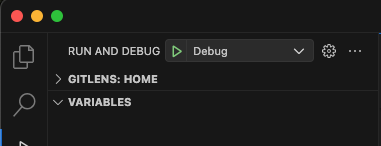

# Music Playlist

- Play/Pause Music
- Play Next/Previous Music
- Reorder Up-Next
- Lyrics (note: some songs may not have lyrics available, api ref: https://lyricsovh.docs.apiary.io/#reference/0/lyrics-of-a-song/search).
- Background audio and integrates with both Android and iOS to manage media playback and display media controls on the lock screen, notification, and Dynamic Island. (note: On the iOS Simulator may has issue please try on real device.)


## Run and Debug

```bash
flutter pub get
```



## Video

https://github.com/user-attachments/assets/8dccd772-4405-46c3-85f4-173a540b368e

## Screenshot


